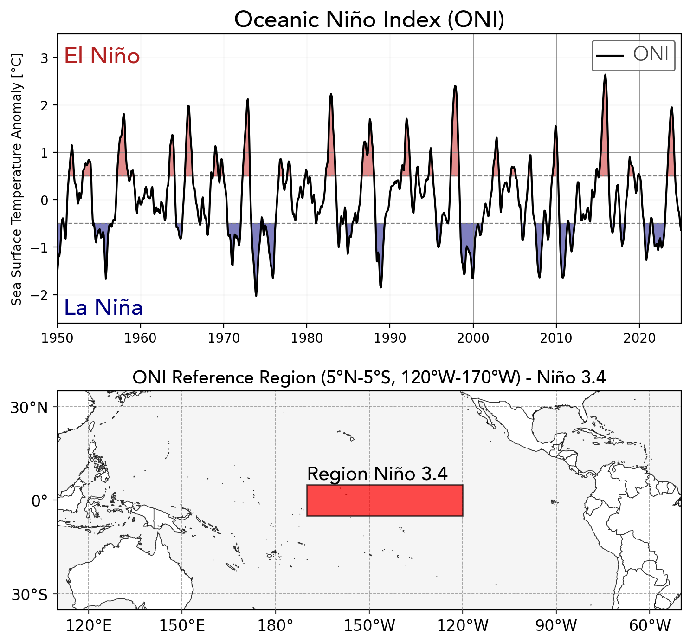

# ENSOconomics: Unveiling the Economic Impact of El Niño and La Niña
Investigate the relationship between ENSO (El Niño–Southern Oscillation) events and economic performance (GDP data) with a focus on sectors such as energy markets.

## What is ENSO and Why is it Important?
ENSO (El Niño–Southern Oscillation) is a recurring climate pattern characterized by fluctuations in sea surface temperatures (SSTs) in the central and eastern tropical Pacific Ocean. It has two primary phases:

* **El Niño:** Warmer-than-average SSTs, often leading to extreme weather events like droughts, floods, and hurricanes.
* **La Niña:** Cooler-than-average SSTs, typically causing opposite weather patterns to El Niño.

## Why is ENSO Important Globally and Economically?
ENSO significantly influences global weather, affecting agriculture, energy markets, infrastructure, and overall economic stability.

- **Agriculture:** ENSO-driven droughts or excessive rainfall impact crop yields, food prices, and trade.
- **Energy Markets:** Changes in temperature and precipitation affect electricity demand, hydropower generation, and fuel prices.
- **Infrastructure & Trade:** Flooding and storms can damage infrastructure, disrupt supply chains, and slow economic growth.

## Monitoring ENSO with the ONI Index
The Oceanic Niño Index (ONI) is the primary measure for identifying ENSO events. It tracks SST anomalies in the Niño 3.4 region (5°N-5°S, 120°W-170°W).

- ONI values ≥ **0.5°C** for five consecutive overlapping three-month periods indicate El Niño.
- ONI values ≤ **-0.5°C** for the same duration indicate La Niña.

    

